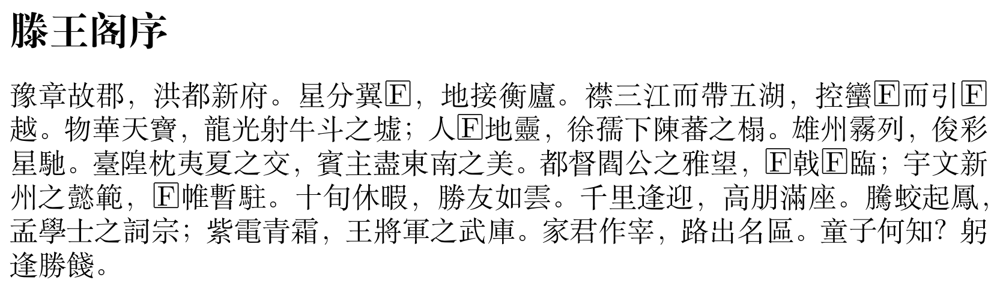
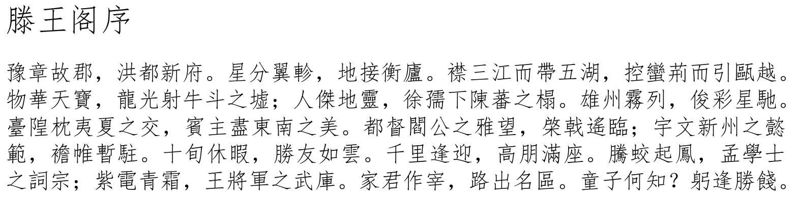
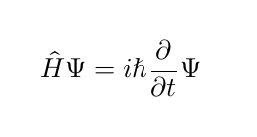
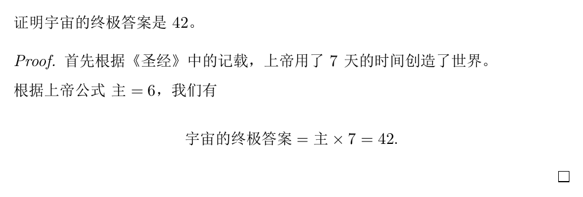
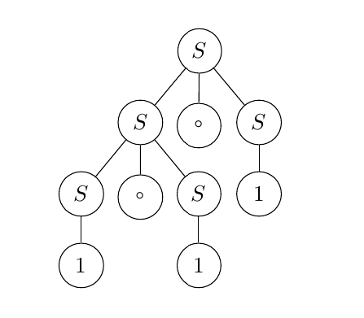

# Pandoc 使用速查

<vue-metadata author="swwind" time="2024-11-10"></vue-metadata>

本文主要为使用 Pandoc 将 Markdown 转换成 PDF 的各种细节进行记录，因为我的记性特别差。

持续更新中。

## 编译

首先需要安装 `texlive` 和 `texlive-langchinese`。

之后确保安装了需要的中文字体。

- `ttf-ms-win11-auto-zh_cn`：包含**微软雅黑**与**宋体**。
- `ttf-ms-win11-fod-zh_cn`：包含**等线体**、**黑体**、**仿宋**和**楷体**。
- `otf-fandol`：包含 Fandol 系列字体。

之后可以在 `.zshrc` 文件中添加下面的别名（如果你特别喜欢每次都手打也可以不做）。

```sh
alias pandoc-zh="pandoc --pdf-engine xelatex -V CJKmainfont='SimSun'"
```

之后通过下面的指令进行编译。

```sh
pandoc    -i english.md -o english.pdf
pandoc-zh -i chinese.md -o chinese.pdf
```

不同字体的大概预览如下。

<figure>
  
  <figcaption>SimSun - 宋体</figcaption>
</figure>

<figure>
  
  <figcaption>FandolSong</figcaption>
</figure>

<figure>
  
  <figcaption>Noto Serif CJK SC - 思源宋体</figcaption>
</figure>

<figure>
  
  <figcaption>FangSong - 仿宋</figcaption>
</figure>

<figure>
  
  <figcaption>SimHei - 黑体</figcaption>
</figure>

## 添加封面

在 Markdown 的最上面添加一些元信息。

```yaml
---
title: "滕王阁序"
subtitle: "秋日登洪府滕王閣餞別序"
author:
  - 王勃（唐）
---
```


其他更多的元信息可以在[官方使用手册](https://pandoc.org/MANUAL.html#variables)中找到。

如果想要封面换页就在最开始添加一行 `\newpage`。

## 调整页面边距

头上加一句话就好了。

```markdown
---
geometry: "left=3cm,right=3cm,top=2cm,bottom=2cm"
---
```

## 引入新包

在元信息中可以通过 `header-includes` 字段来引入自定义的包。

```markdown
---
header-includes:
  - \usepackage{physics}
---

$$
\hat{H} \Psi = i \hbar \pdv{t} \Psi
$$
```



### 证明

需要使用 `\hajimaru` 和 `\owaru` 来避开 `\begin` 和 `\end`，因为 pandoc 不会针对 `\begin{xxx} ... \end{xxx}` 中的内容进行 Markdown 语法解析，可能会导致中间的内容出现问题。

```markdown
---
header-includes:
  - \usepackage{amsmath}
  - \usepackage{amssymb}
  - \usepackage{amsthm}
---

\let\hajimaru\begin
\let\owaru\end

证明宇宙的终极答案是 $42$。

\hajimaru{proof}

首先根据《圣经》中的记载，上帝用了 $7$ 天的时间创造了世界。

根据上帝公式 $\text{主} = 6$，我们有

$$
\text{宇宙的终极答案} = \text{主} \times 7 = 42.
$$

\owaru{proof}
```



### 画图

下面的代码是 chatGPT 生成的。

<!-- prettier-ignore -->
```markdown
---
header-includes:
  - \usepackage{tikz}
  - \usetikzlibrary{trees}
  - \usepackage{forest}
---

\begin{center}
\begin{forest}
  for tree={circle, draw, minimum size=2em, inner sep=1pt, l=1cm}
  [$S$
    [$S$
      [$S$ [$1$]]
      [$\circ$]
      [$S$ [$1$]]
    ]
    [$\circ$]
    [$S$ [$1$]]
  ]
\end{forest}
\end{center}
```



## 留言

如果你有其他值得记录的也可以分享。

<vue-reactions path="pandoc-memo"></vue-reactions>
