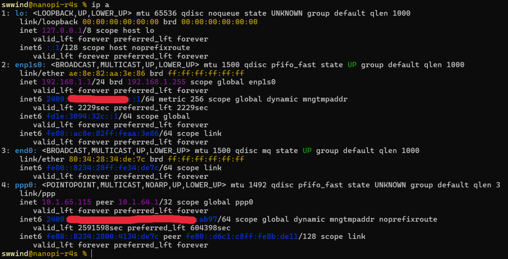

# Linux 软路由：PPPoE 拨号与网络配置

<vue-metadata author="swwind" time="2025-6-14"></vue-metadata>

## 前言

从家里开数据中心的群友那里{搞}^(白嫖)来了一台 NanoPi R4S，准备用来替换原来的小米路由器，这样我就可以将原来放在小主机上的网络服务全部迁移到路由器上了，可以减少一部分通信量。

<figure>

<figcaption>图 1. 群友水平</figcaption>
</figure>

具体来说，我们希望这台设备能够负责如下功能：

1. 从上游 PPPoE 拨号访问互联网（宽带上网）；
2. 对内网设备提供基本的 DHCP 和 DNS 等服务；

诚然，这些事情可以直接刷一个 OpenWRT 来直接手动配置，但是我并不想把这台设备只当一个路由器来用，所以我计划安装更加一般的 Linux 发行版，以便充分榨干这个设备可以提供的计算资源。

但是，在普通 Linux 发行版上实现软路由的相关功能（例如 PPPoE 拨号等）需要比较复杂的配置，网上资料较少，并且大部分人并不怎么关心 ipv6 的配置，让我非常头疼。

但好在有群友的帮助，我最后终于折腾出来一套比较满意的解决方案。

本文基于 Armbian 发行版（~~因为太菜了装不上 Arch Linux ARM[^1]~~），同时也适用于其他使用 systemd 全家桶的发行版，可以作为参考。

## 技术背景

首先你应该学过计算机网络（例如应该知道路由器和交换器的区别），否则可能比较难以理解下文的内容。

### PPPoE 拨号上网

假设你是普通家庭宽带的应用场景，运营商（例如中国移动）在帮你安装宽带的时候会送给你一个调制解调器（俗称光猫），一般来说拨号的部分会在这个光猫里面进行，用户无需手动干预，直接插入光猫就可以获得内网地址，并访问外网。但是由于这个光猫比较 malicious，可能会在背地里偷偷做一些偷鸡摸狗的事情，因此最好是将其从路由模式修改成桥接模式，然后使用自己的路由器进行拨号上网。但是想要修改光猫的配置需要一个超级管理员账号，超级远古的光猫的密码可能能在网上搜到，但是大部分新一代光猫的超级管理员账号密码一般都是随机生成的。想要知道账号和密码的话，建议主动询问给你装宽带的师傅。

把光猫修改成桥接之后，我们就需要手动拨号上网。PPPoE 是普遍使用的拨号上网协议，可以使用 pppd 软件来在 Linux 下进行拨号。拨号需要一个账号密码，但是我相信你应该知道。拨号成功之后，你将会获得一个 ipv4 地址（一般是个内网地址），以及一个 ipv6 的链路地址（形如 `fe80::` 开头）。其中获得的 ipv4 地址可以直接用来上网，但是对于 ipv6 来说，我们还需要使用 DHCPv6 客户端进行一次前缀委托（DHCPv6 Prefix Delegation, DHCPv6-PD），才能从运营商处获取到能够路由到本机的公网 ipv6 地址。

网上经常有人说 systemd-networkd 不支持 PPPoE 拨号，它确实不支持，但是我们可以单独运行一个 pppd 进行拨号，剩余工作仍然可以交给 systemd-networkd 完成。

### 内网管理

由于家庭里面的上网设备并不多（~~也就只用了两个八口交换机~~），我们只规划一个子网，由软路由担任分配地址和路由的工作。

子网的地址如下：

- `192.168.1.1/24`
- `fdaa:bbbb:cccc::1/64`

其中 ipv4 通过 NAT 访问外网，ipv6 直接使用分配的公网地址上网，内网地址仅用于内网设备直接通信（~~可以不用但不能没有~~）。

### 防火墙

记住，不要忘记设置防火墙！否则你就等着自己电脑数据全部变成灰吧。

~~常见防火墙软件有 ufw、firewalld 等。~~
但是我都不想用，因为我觉得不如直接手写 iptables 规则来的直接，毕竟这些防火墙软件后台也还是调用 iptables 的。

考虑一下需求情况，假设路由器本身为 device，我们希望：

- 禁止 WAN -> device
- 禁止 WAN -> LAN
- 允许 WAN -> device 的 DHCPv6
- 允许 WAN -> device/LAN 的回复数据包
- 允许所有 ICMP & ICMPv6
- 允许内网之间的所有数据包
- 允许 LAN -> WAN
- 允许 device -> WAN
- 禁止其他所有数据包

最后我们会使用 nftables 实现防火墙。

## 操作过程

### 刷系统

从 Armbian 官网上面下载 R4S 的镜像，然后直接用 `dd` 烧录到 SD 卡中即可。

```sh
sudo dd if=Armbian_xxxx.img of=/dev/sdX bs=1M
```

完成之后把 SD 卡插到 R4S 上面，接上电源应该就能开机了。如果一切正常，你可以看到 SYS 灯亮起，这说明已经成功进入系统了。

接着将软路由的 WAN 口插到路由器上，我们就可以 ssh 到软路由上进行网络配置了（默认 root 密码是 1234）。

第一次进入系统会提示你修改密码，创建用户之类的，照着做就好了。

之后使用 `ip a` 观察每个网口的情况，找到 WAN 口的网络接口名称（下文简称 `wan0`），以及 LAN 口的接口名称（下文简称 `lan0`）。

### 安装依赖

趁我们现在还有公网访问，先装一个 ppp。

```sh
sudo apt install ppp
```

接下来的操作如果执行不当可能会连不上软路由，那么就需要从刷系统开始全部重来。

因此可以将配置环境/安装其他软件等工作放到网络配置好了之后再做，以免坠机。

### 干掉 netplan

Armbian 默认使用 netplan 配置网络，但是我准备直接用 systemd-networkd，所以我们先把他干掉。

```sh
sudo mv /etc/netplan/10-dhcp-all-interfaces.yaml{,.bak}
```

这时候不要急着重启 systemd-networkd，我们先给 `lan0` 添加基础的内网地址和 DHCP 功能。

```toml
# /etc/systemd/network/20-lan0.network
[Match]
Name=lan0

[Network]
Address=192.168.1.1/24
DHCPServer=yes
IPv6SendRA=yes

[DHCPServer]
PoolOffset=16
PoolSize=128
EmitDNS=yes

[IPv6Prefix]
Prefix=fdaa:bbbb:cccc::/64
Assign=yes
Token=::1
```

之后可以重启软路由，拔掉 WAN 口上的网线，直接将电脑连到软路由的 LAN 口上。

等待软路由重启之后，应该可以看到电脑被分配了 `192.168.1.0/24` 的地址，并且执行 `ping 192.168.1.1` 可以成功访问。

重新 ssh 到服务器，开始接下来的配置。

### 开启路由转发

由于我们要把设备当路由器使，需要手动打开数据包转发的功能。

```sh
# /etc/sysctl.d/10-forward.conf
net.ipv4.conf.all.forwarding=1
net.ipv4.conf.default.forwarding=1
net.ipv6.conf.all.forwarding=1
net.ipv6.conf.default.forwarding=1
```

这个配置文件会开机自动应用，也可以使用 `sudo sysctl --system` 来手动应用。

### 配置 pppd

此前我们安装了 ppp 包，但是其中并不包含 systemd service 文件，因此我们从 Arch 系的包里面偷一个过来（有修改）：

```toml
# /usr/lib/systemd/system/pppd@.service
[Unit]
Description=PPP link to %I
After=systemd-networkd.service

[Service]
Type=notify
ExecStart=/usr/sbin/pppd call %I nodetach nolog up_sdnotify

[Install]
WantedBy=multi-user.target
```

然后添加 `wan0` 的拨号配置文件（修改相应名称）

```toml
# /etc/ppp/peers/wan0
linkname "wan0"

updetach
plugin rp-pppoe.so
nic-wan0

noauth
defaultroute
maxfail "5"
usepeerdns
"persist"

user "your-pppoe-user"
password "your-pppoe-password"
```

在启动服务之前，我们需要先手动启用网口。

```sh
sudo ip link set dev wan0 up
```

然后将 WAN 口插到光猫桥接的出口，启动 `pppd@wan0.service` 观察是否成功拨号。

如果拨号成功，使用 `ip a` 可以看到多出来一个 `ppp0` 接口，并且有一个 ipv4 地址和一个 ipv6 的链路地址。

此时软路由应该通过 ipv4 访问外网，可以使用 `ping 223.5.5.5` 检查链路是否畅通。

如果以上都没有问题，说明一切正常，我们可以将这个服务设置为开机自启。

```sh
sudo systemctl enable pppd@wan0.service
```

此外，为了避免每次手动启用网口，可以添加配置文件让 systemd-networkd 帮我们自动启动。

```toml
# /etc/systemd/network/20-wan0.network
[Match]
Name=wan0

[Network]
```

这也就是为什么我们要指定 `pppd@wan0.service` 在 `systemd-networkd.service` 之后运行的原因。

### 配置 DHCPv6 PD

同样我们使用 systemd-networkd 来尝试从 `ppp0` 中获取公网 ipv6 地址。

```toml
# /etc/systemd/network/20-ppp0.network
[Match]
Name=ppp0

[Network]
KeepConfiguration=yes
DHCP=ipv6

[DHCPv6]
WithoutRA=solicit

[IPv6AcceptRA]
DHCPv6Client=always
```

需要同步修改 `20-lan0.network` 以应用前缀到该网口

```toml
# /etc/systemd/network/20-lan0.network
[Match]
Name=lan0

[Network]
Address=192.168.1.1/24
DHCPServer=yes
DHCPPrefixDelegation=yes
IPv6SendRA=yes
IPv6AcceptRA=no

[DHCPServer]
PoolOffset=16
PoolSize=128
EmitDNS=yes

[IPv6Prefix]
Prefix=fdaa:bbbb:cccc::/64
Assign=yes
Token=::1

[DHCPPrefixDelegation]
UplinkInterface=ppp0
SubnetId=0
Annouce=yes
Token=::1
```

编辑完成之后直接重启 `systemd-networkd.service`，等待若干秒应该可以看到 `lan0` 获得了整块的公网 ipv6 地址。

至此基础网络配置完成，如下图所示，此时路由器应该可以同时使用 ipv4 和 ipv6 访问互联网。

<figure>

<figcaption>图 2. 网络配置结果</figcaption>
</figure>

注意到目前的配置都没有添加 ipv4 的 NAT 步骤，因此子网内设备可能还不能通过 ipv4 访问互联网（ipv6 应该已经可以了）。

### 防火墙

我们希望通过 nftables 统一管理所有网络规则，同时在这里设置 ipv4 的 NAT 规则。

基于上面的需求，我们可以编辑 `/etc/nftables.conf`

```toml
#!/usr/sbin/nft -f

flush ruleset

# 定义接口变量
define LAN_IF = "lan0"
define WAN_IF = "ppp0"   # 这里用的是拨号后的接口ppp0

table inet filter {
    chain input {
        type filter hook input priority 0; policy drop;

        # Allow lo
        iif "lo" accept

        # Allow ICMP
        ip protocol icmp accept
        ip6 nexthdr icmpv6 accept

        # Allow DHCPv6 from WAN
        iif $WAN_IF ip6 saddr fc00::/6 ip6 daddr fc00::/6 udp dport 546 accept

        # Allow from LAN
        iif $LAN_IF accept

        # Allow connected
        ct state established,related accept
    }

    chain forward {
        type filter hook forward priority 0; policy drop;

        # Allow ICMP & ICMPv6
        ip protocol icmp accept
        ip6 nexthdr icmpv6 accept

        # Allow LAN->LAN
        iif $LAN_IF oif $LAN_IF accept

        # Allow LAN->WAN
        iif $LAN_IF oif $WAN_IF ct state new,established,related accept

        # Allow WAN->LAN connection
        iif $WAN_IF oif $LAN_IF ct state established,related accept
    }

    chain output {
        type filter hook output priority 0; policy accept;
    }
}

table ip nat {
    chain postrouting {
        type nat hook postrouting priority 100; policy accept;

        # LAN MASQUERADE
        oif $WAN_IF ip saddr 192.168.1.0/24 masquerade
    }
}
```

之后使用 `sudo nft -f /etc/nftables.conf` 应用配置。如果访问没有问题，那么说明一切正常。

考虑如何使其开机自动启动。显然，在 `pppd@wan0.service` 完成拨号之前，`ppp0` 接口是不存在的，因此直接开机自启 `nftables.service` 会直接报错。

我们采用 ppp 提供的钩子，编辑 `/etc/ppp/ip-up.d/1-nftables`

```bash
#!/bin/bash

nft -f /etc/nftables.conf
```

添加可执行文件权限

```sh
sudo chmod +x /etc/ppp/ip-up.d/1-nftables
```

这样 ppp 完成拨号之后会自动调用该脚本，从而启动防火墙了。

## 最终整理

如果不出所料，开机之后的行为应该是这样的：

1. systemd-networkd 先把 wan0 启用
2. ppp 从 wan0 上拨号，获得 ppp0 接口
3. ppp 启动防火墙，应用 nftables 规则
3. systemd-networkd 自动从 ppp0 中获得公网地址，应用到 lan0 上

可以反复重启测试，确认网络栈没有问题之后就可以放心安装其他软件了。

其他工作，例如配置 DDNS 等，以后有机会了再说吧。

## 评论

<vue-reactions path="soft-router-network"></vue-reactions>

[^1]: 参考[NanoPi R4S上手 & 安装Arch Linux ARM](https://blog.starry-s.moe/posts/2022/nanopi-r4s/)，但是我失败了
